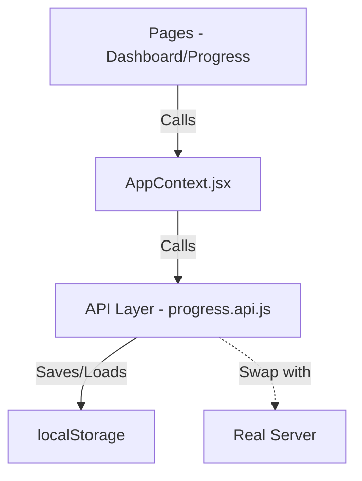

# Skill Master: Project System Explainer

Welcome to the internal workings of **Skill Master**. This document explains how the application "thinks" and how data moves between files.

## 1. High-Level Architecture
Skill Master is built on a **Mock-First Architecture**. We use a real API layer, but it talks to a "Simulated Backend" (the mocks) instead of a live server. This allows us to build and test the entire UX before the backend is even written.

---

## 2. Key Folder Structure

### `/src/api` (The Brain)
- **`axiosInstance.js`**: The central connection point. Currently configured for mocks, but ready for a real URL.
- **`progress.api.js`**: **The Logic Engine.** It determines if you pass an exam, what day comes next, and saves your progress to your browser's memory (`localStorage`).
- **`roadmap.api.js`**: Handles the loading of the learning path (curriculum).

### `/src/context` (The Orchestrator)
- **`AppContext.jsx`**: This is the "Data Manager". It holds the `progress` and `roadmap` data in global memory. When you finish a lesson, the UI tells the Context, and the Context tells the API to save it.

### `/src/pages/SessionPage` (The Engine)
- **`SessionPage.jsx`**: A "Phase Machine". It looks at the current day and decides whether to show a **Lesson**, a **Task**, or an **Exam**. It "swaps" components based on where you are in the session.

---

## 3. The Action Flow (Junior Level)

**Question: What happens when I click "Complete Session"?**
1. **The Phase Component** (e.g., `LessonPhase`): Calls the `onComplete` callback.
2. **The Session Page**: Receives this event and calls `advanceProgress(dayId)` from the `useApp` hook.
3. **AppContext**: The Hook calls `updateProgress` in `progress.api.js`.
4. **The Mock API**: 
    - Finds your current day in `localStorage`.
    - Increments the day (e.g., Monday -> Tuesday).
    - Returns the **new updated state**.
5. **UI Update**: `AppContext` updates its internal state. Since React is "reactive", your Dashboard and Progress page instantly update to show the new day.

---

## 4. Known Data "Tripwires" (Why bugs happen)
1. **ID Formats**: We use composite IDs like `m1-w1-d1`. If a function expects a simple number `1` but gets a string `m1-w1-d1`, it fails. This is currently causing your "0 sessions" bug.
2. **Object vs. String**: The `examScores` list stores **Objects** `{ score: 85, passed: true }`. If the UI tries to print the whole object instead of just `object.score`, you see `[object Object]`.
3. **Empty Data**: If we navigate to a day that doesn't exist in our hardcoded `roadmap.json`, the dashboard goes blank because it can't find a title for a missing day.
